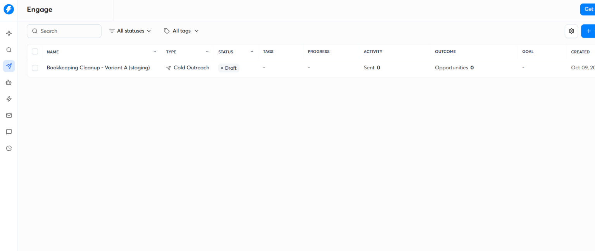
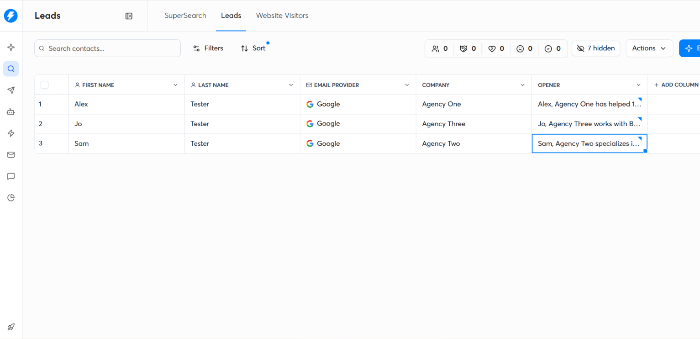

# Cold Email Sequences: Bookkeeping Cleanup for Agencies

**Outcome:** Two 3-email sequence variants for a bookkeeping-cleanup offer, each with a hypothesis and a measurement plan, built on the fact-checked openers from my Clay list. Drafts only: Nothing has been sent.

## The offer
Done-for-you bookkeeping cleanup and monthly close for small US marketing agencies (11-50 employees). This is a practice offer for the portfolio.

## Rules I wrote to
- Plain text, 60-90 words per email, no images, no tracking-heavy formatting
- One soft ask per email (an interest question, not a calendar link)
- No claimed results, clients, or conversations I haven't had
- An opt-out line in every email, plus the technical one-click unsubscribe header added by the sending tool
- Merge fields: `{{opener}}` (the fact-checked line from Clay, which already starts with the first name), `{{first_name}}`, `{{company}}`

## Variant A: "Clean books, clear numbers"
**Hypothesis:** founders respond more to a visibility benefit (seeing margin by client and what they can afford to hire).

**Email 1 (day 0)**
Subject: `Month-End at {{company}}`
```
{{opener}}

When the books run behind, it's hard to see margin by client or what you can afford to hire next. I help small agencies get caught up and keep a clean monthly close.

Is month-end something you'd like off your plate? If this isn't relevant, tell me and I won't follow up.

Denise
```

**Email 2 (day 3)**
Subject: `Re: Month-End at {{company}}`
```
Hi {{first_name}},

Following up in case my note got buried. What I do is simple: clean up the backlog, reconcile the accounts, and deliver a close each month so you can see where the agency stands.

Would a short call on how you handle close today be useful? Happy to drop it if not.

Denise
```

**Email 3 (day 7)**
Subject: `Closing the Loop`
```
Hi {{first_name}},

Last note from me. If clearer numbers at month-end aren't a priority right now, no problem, I'll leave you be.

If they are, reply "yes" and I'll send a short outline of how a cleanup works. No call needed.

Denise
```

## Variant B: "Agency-specific pain"
**Hypothesis:** agency-specific language gets more replies because it signals relevance.

**Email 1 (day 0)**
Subject: `Agency Bookkeeping`
```
{{opener}}

Retainers, freelancers, and project billing make agency books messy fast. I do bookkeeping cleanup and monthly close for small agencies.

Is bookkeeping handled in-house, or by someone outside the team? If this isn't relevant, tell me and I won't follow up.

Denise
```

**Email 2 (day 4)**
Subject: `re: Agency Bookkeeping`
```
Hi {{first_name}},

A common snag for agencies is matching contractor payments and retainer income to the right client and month. I set that up so close doesn't turn into a scramble.

Worth a quick reply on how you handle it today?

Denise
```

**Email 3 (day 9)**
Subject: `Should I close this out?`
```
Hi {{first_name}},

I'll stop here so I don't clutter your inbox. If bookkeeping is already sorted, great.

If it ever isn't, reply and I'll send a short outline of how I'd approach it.

Denise
```

## Example of the personalization (from my Clay list)
`[First name], Refine Labs has helped 300+ B2B tech companies since 2019.` (checked against their site before use)

## Test plan
- **Split:**Half the list gets A and half gets B, assigned at random, with the same send times and the same sending mailbox setup
- **Measure:** Positive replies per 100 delivered (the main number), total reply rate, bounce rate, and unsubscribes. I wouldn't use opens, since open tracking is unreliable
- **Sample size:** My list has 10 contacts, which is far too few to call a winner. A real test needs a few hundred delivered emails per variant. This plan shows how I'd run it, and I'm not claiming results
- **Decision rule:** Pick the variant with more positive replies once each has enough volume, then test one change at a time (subject line, first line, ask)
- **Guardrails:** Keep bounces and spam complaints very low, pause a variant if either rises, and verify every list before sending

## Before any real send
- Warm up the mailboxes and use a mailbox plan that works with an outreach tool
- Add a sender identity and a physical mailing address in the footer, and check current requirements (for the US, CAN-SPAM)
- Confirm the one-click unsubscribe header in Gmail's "Show original"
- Re-check every merged fact against the company's own site

## What I'd improve
- Use hiring signals (for example, a posted finance role) as a trigger for a third variant
- Add a LinkedIn touch between emails 1 and 2

**Bookkeeping Cleanup Test Campaign**


**Lead List**

