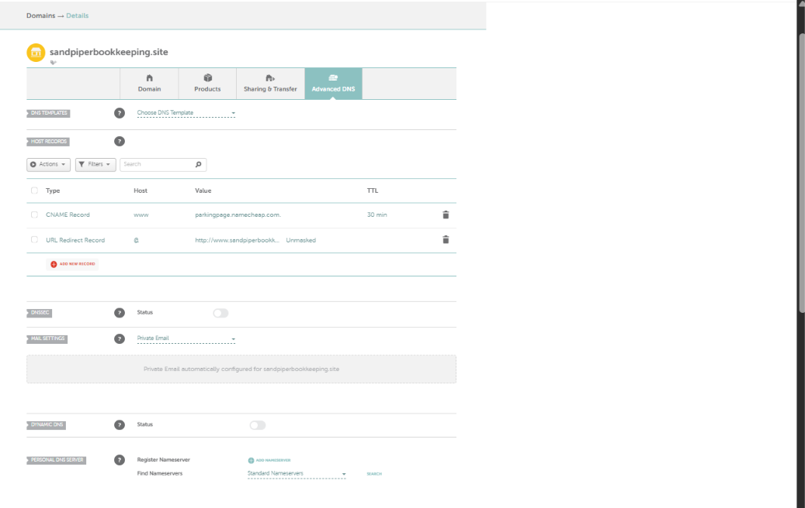
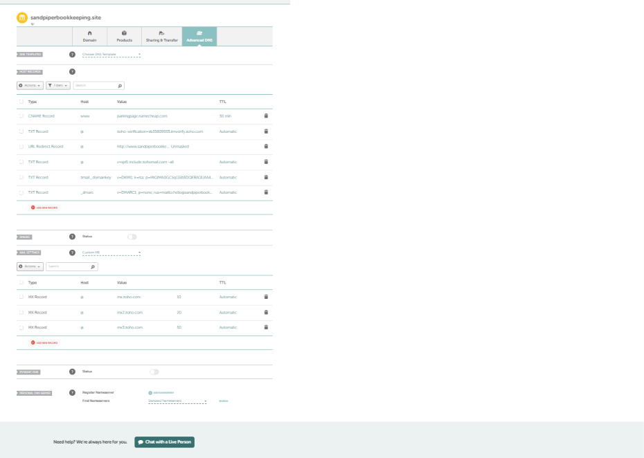
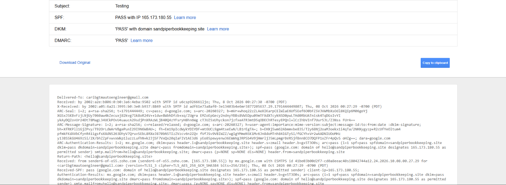
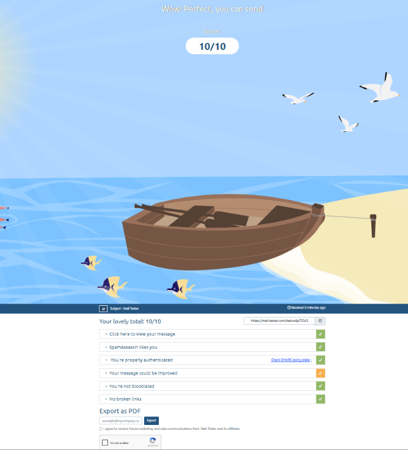
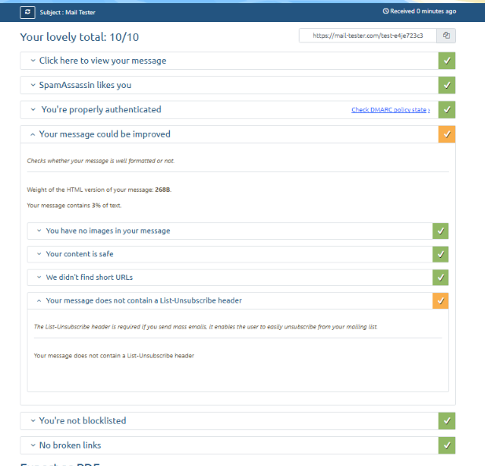

# Deliverability Setup: Sending Domain Authentication

**Outcome:** Set up SPF, DKIM, and DMARC on a separate sending domain, then tested it. A test message passed all three checks in Gmail and scored 10/10 on mail-tester.

## What this is
Cold email only works if it reaches the inbox. I set up a practice domain the way an outbound agency would: separate from any main brand, with a real mailbox and full authentication.

## Setup
1. Bought a separate .site domain with privacy on, registrar login secured with two-factor
2. Created a mailbox with Zoho Mail's free plan and verified domain ownership with a TXT record
3. Added three MX records, one SPF record, one DKIM record, and a DMARC record in monitoring mode (p=none)
4. Confirmed MX, SPF, and DKIM as verified in the Zoho admin console

## The records, in plain English
- **SPF:** lists the servers allowed to send mail for the domain
- **DKIM:** signs each message so receivers can check it wasn't altered
- **DMARC:** tells receivers what to do when SPF or DKIM fail and where to send reports. I started with monitoring only (p=none)

## Tests
- Gmail "Show original": SPF PASS, DKIM PASS, DMARC PASS
- mail-tester.com: 10/10
- mail-tester flagged one item: no List-Unsubscribe header. That header lets recipients unsubscribe in one
  click and is expected on bulk mail. A single test message doesn't need it, but any real campaign should
  include an unsubscribe option (many outreach tools can add the header, so check the one I use).

## Screenshots

## What I'd do before real outreach
- Warm up the mailboxes gradually for a few weeks before any campaign
- Keep daily volume low per mailbox and watch bounce and complaint rates
- Use a mailbox plan that supports IMAP/SMTP, since Zoho's free plan doesn't, and outreach tools need it
- Verify every list first (as I did in the Clay build) to keep bounces down
- Move DMARC from monitoring to a stricter policy once the reports look clean
- Never send cold email from a main brand domain

## Limits of this test
A passing test shows the setup is correct. It doesn't show inbox placement at volume, because that depends on sender reputation, which a new domain hasn't built yet. This domain has sent no outreach.
